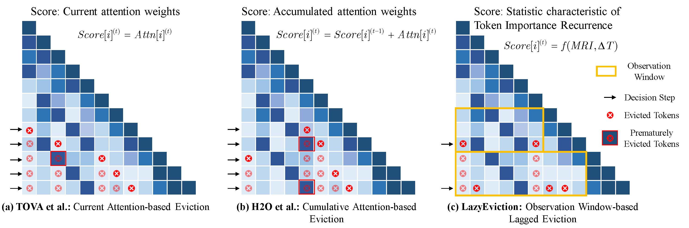
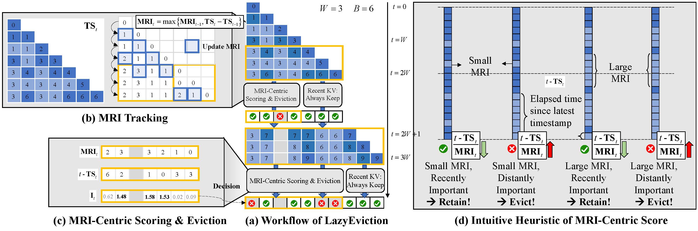
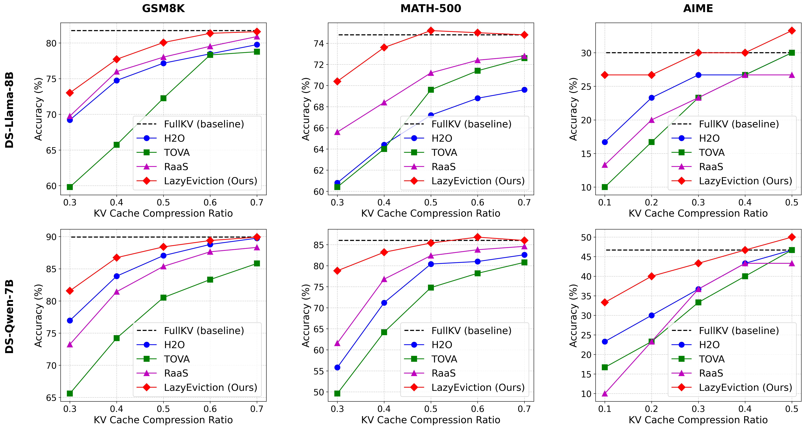

<h1 align="center"> LazyEviction: Lagged KV Eviction with Attention Pattern Observation for Efficient Long Reasoning </h1>

<p align="center">
  <a href="https://arxiv.org/abs/2506.15969">
    
  </a>
  <a href="https://github.com/Halo-949/LazyEviction">
    
  </a>
  <a href="https://github.com/Halo-949/LazyEviction/blob/main/LICENSE">
    
  </a>
</p>

<h5 align="center"> ⭐ If you like our project, please give us a star on GitHub for the latest updates!</h5>

---
- **Paper**: https://arxiv.org/abs/2506.15969
- **GitHub**: https://github.com/Halo-949/LazyEviction


- **LazyEviction** is specially designed for KV cache eviction in long reasoning scenarios, motivated by a *Token Importance Recurrence* phenomenon in the reasoning task, where specific tokens exhibit recurrent attention patterns. 


<div align="center">
  
  <br>
  <em>Compared with the exsiting KV Eviction methods, (a) Current Attention-based Eviction executes stepwise evictions using immediate attention scores. (b) Cumulative Attention-based Eviction integrates historical attention for eviction decisions. Both (a) and (b) fail to preserve recurring tokens during their low-attention intervals. (c) LazyEviction performs lagged KV evictions based on the observation window to detect latent recurring tokens and prevent prematurely discarding them.</em>
</div>

<span id='features'/>

## Framework 🏗️

<div align="center">
  
  <br>
  <em>LazyEviction is an observation window-based lagged KV eviction scheme, which shifts from step-wised greedy eviction to window-wised predictive retention. Including: (b) Recurrence Interval Tracking and (c) MRI-Centric Eviction Policy. </em>
</div>

<span id='news'/>

## 📢 News

- **[2025-10-13]**: 🎉 LazyEviction project is officially Open-Sourced!


<span id='start'/>

## Getting Started 🚀

1. Clone the repository:
```bash
git clone https://github.com/Halo-949/LazyEviction
cd LazyEviction
```

2. Install dependencies:

```bash
# Create and activate conda environment
conda create -n myenv python=3.12
conda activate myenv

# Install dependencies
pip install -r requirements.txt
```

3. Use the following command to run models with LazyEviction on math benchmarks:
```python
bash eval_llama.sh
bash eval_qwen.sh
```

**Note:** To achieve the optimal performance reported in our paper, please adjust the hyperparameter W and alpha accordingly.


<span id='results'/>

##  Main Results ⚡️

<div align="center">
  
  <br>
  <em>LazyEviction maintains optimal performance across various budgets among datasets and models, achieving performance close to FullKV with only 30%~50% KV budgets. Notably, on MATH-500 and AIME datasets, LazyEviction even outperformed FullKV's performance while reducing the KV cache budget by 50%. </em>
</div>

## Citation 📚

If you use this code in your research, please cite our work:

```bibtex
@article{zhang2025lazyeviction,
  title={LazyEviction: Lagged KV Eviction with Attention Pattern Observation for Efficient Long Reasoning},
  author={Zhang, Haoyue and Zhang, Hualei and Ma, Xiaosong and Zhang, Jie and Guo, Song},
  journal={arXiv preprint arXiv:2506.15969},
  year={2025}
}
```

## Acknowledgement

Thanks [**KVCache-Factory**](https://github.com/Zefan-Cai/KVCache-Factory) for providing open-source code to support the expansion of this project.

Thanks [**TokenSkip**](https://github.com/hemingkx/TokenSkip) for their code on math reasoning dataset evaluation.

## License 📄

This project is licensed under the MIT License. See LICENSE for details.